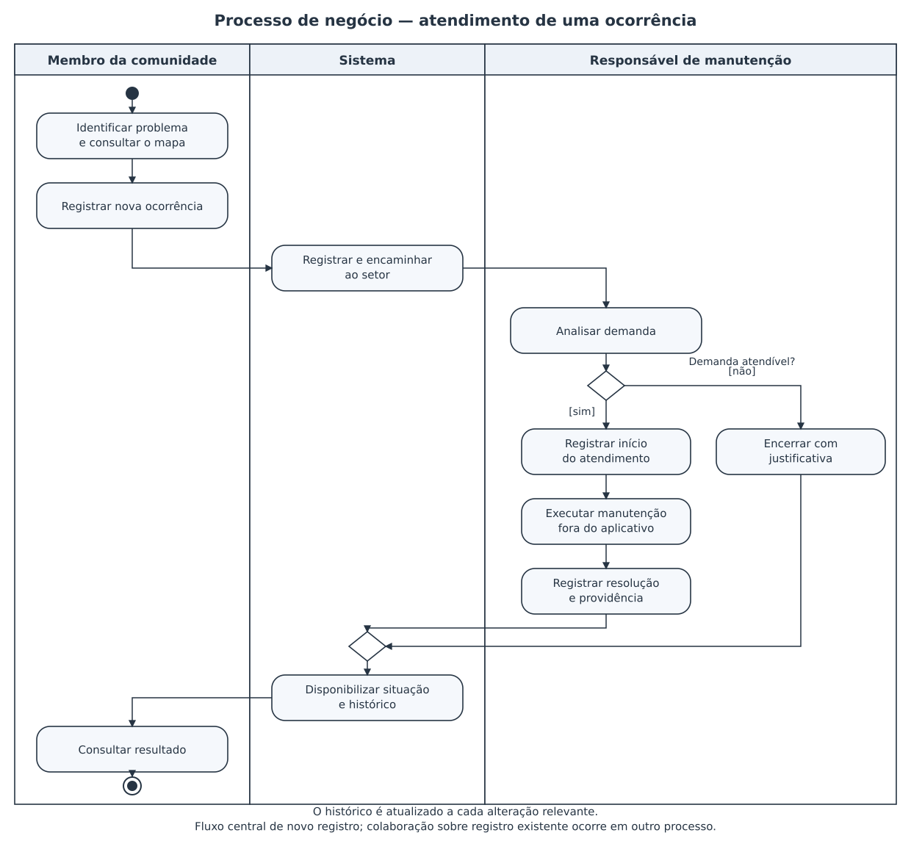
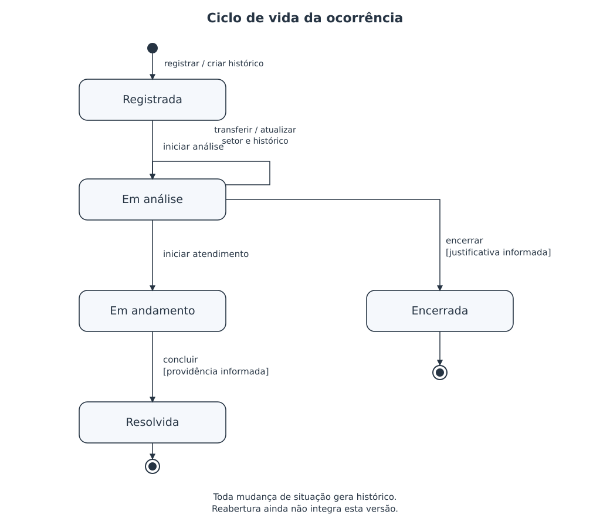
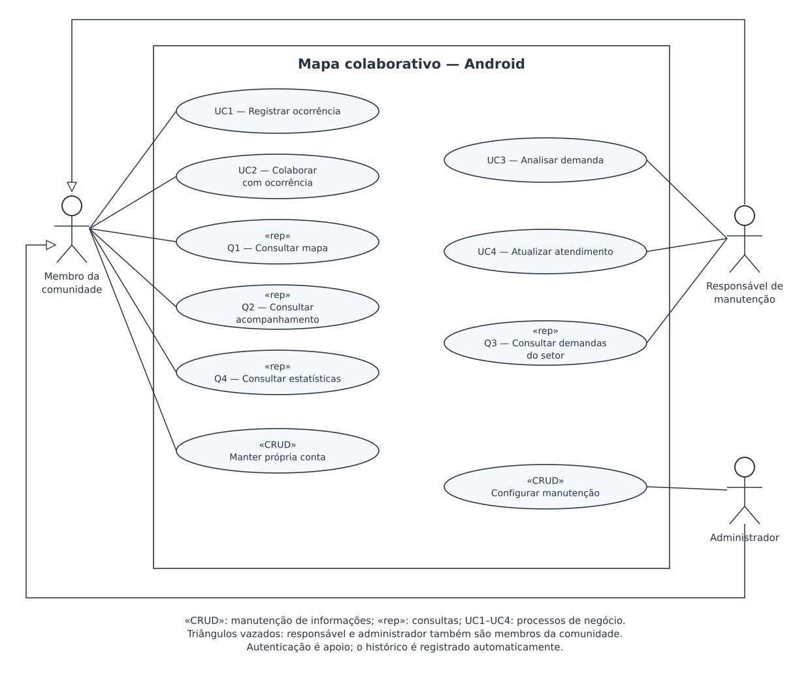
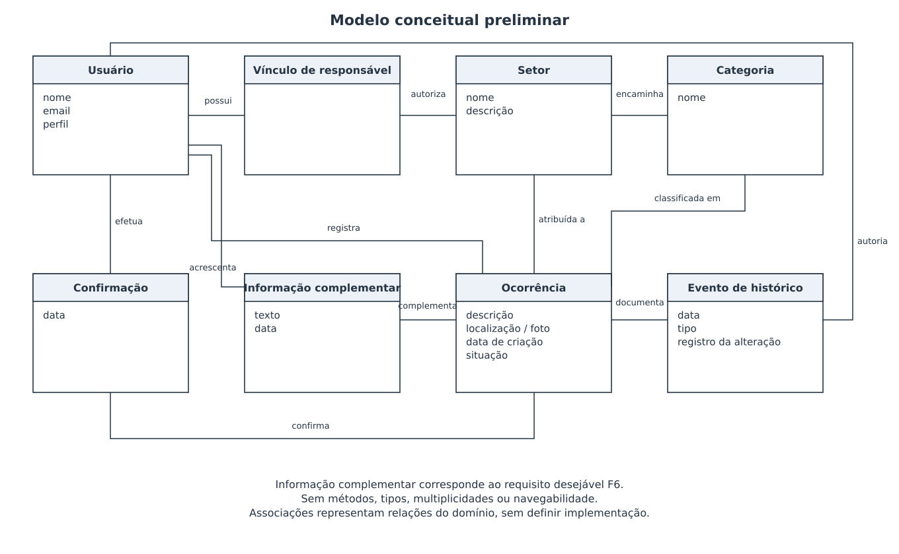

# Concepção — Mapa colaborativo de ocorrências da UFV, campus Viçosa

**Disciplina:** Engenharia de Software II  
**Grupo 5:** Lucas Carvalho de Góes, Luka Gouvêa e Gabriel Ferreira  
**Data:** 04/10/2026 

## 1. Visão geral do sistema

A comunidade universitária encontra problemas de manutenção em diferentes locais do campus, como falhas de iluminação, vazamentos, equipamentos danificados e barreiras de acessibilidade. A comunicação dispersa dificulta localizar os problemas, identificar quem deve atendê-los e acompanhar as providências. O projeto propõe um aplicativo Android que centralize esses registros em um mapa do campus Viçosa da Universidade Federal de Viçosa.

Um membro da comunidade poderá registrar uma ocorrência com localização, categoria, descrição e foto opcional. Outros membros poderão confirmar que observaram o mesmo problema e acrescentar informações. Cada ocorrência será encaminhada a um setor de manutenção e poderá ser acompanhada desde o registro até a resolução ou o encerramento justificado. O histórico permitirá consultar as alterações e as providências adotadas. Consultas e estatísticas apoiarão a identificação de demandas recorrentes e o acompanhamento do atendimento.

Os setores serão grupos de responsabilidade configuráveis, como manutenção elétrica, hidráulica ou de equipamentos. Não precisarão corresponder à estrutura administrativa real da universidade. O administrador poderá criar setores, definir categorias e vincular usuários responsáveis pelo atendimento. Essas configurações permitirão adaptar a organização do trabalho sem mudar o aplicativo.

O cadastro será simples. Para o projeto acadêmico, toda pessoa que criar uma conta será considerada membro da universidade, sem integração com sistemas institucionais ou comprovação de vínculo. Todos os perfis utilizarão o aplicativo Android.

**Benefícios esperados:** centralizar a comunicação, facilitar a localização dos problemas, reduzir relatos dispersos e dar visibilidade ao andamento das demandas. O software registra e acompanha o atendimento; a execução física da manutenção depende dos responsáveis.

**Construir ou adquirir:** será construído um protótipo para aplicar os conteúdos da disciplina. Essa escolha tem finalidade didática; não resulta de uma comparação comercial de soluções nem de uma contratação pela UFV.

### 1.1 Escopo

**Incluído:** contas e acesso; mapa e filtros; registro e colaboração sobre ocorrências; encaminhamento e atendimento por setores; histórico; configuração dos setores, categorias e responsáveis; estatísticas básicas.

**Fora do escopo inicial:** ocorrências da cidade ou de outros campi; versão web ou iOS; autenticação institucional; atendimento de emergências; compras, estoque, escala de equipes e gestão financeira da manutenção; detecção automática de problemas; operação offline e notificações push. Essas exclusões limitam o projeto acadêmico e podem ser revistas em uma evolução.

### 1.2 Atores

| Ator | Responsabilidade |
|---|---|
| Membro da comunidade | Registrar e consultar ocorrências, confirmar problemas e acrescentar informações. |
| Responsável de manutenção | Analisar e atender ocorrências dos setores aos quais está vinculado. Também pode atuar como membro da comunidade. |
| Administrador | Configurar setores, categorias e vínculos dos responsáveis. Também pode atuar como membro da comunidade. |

**Definido pelo grupo:** campus Viçosa; cadastro simples; setores dinâmicos de manutenção; somente Android; concepção em alto nível.

**Hipóteses desta versão:** um setor pode ter vários responsáveis e um responsável pode atuar em vários setores; cada categoria encaminha inicialmente para um setor; cada ocorrência possui um setor responsável por vez; a administração não concede automaticamente acesso ao atendimento de todos os setores. As questões de validação estão no documento de pendências.

### 1.3 Compreensão do negócio

#### 1.3.1 Processo principal

A comunidade identifica um problema e consulta o mapa. Se o problema já estiver registrado, pode colaborar com a ocorrência existente. Caso contrário, registra uma nova ocorrência. O sistema a encaminha ao setor associado à categoria. Um responsável analisa a demanda e, quando cabível, inicia a manutenção. Após executar a providência, registra a resolução. Uma demanda que não possa prosseguir pode ser encerrada com justificativa.

O diagrama representa o processo de negócio, incluindo a manutenção física realizada fora do aplicativo. O fluxo de cadastro de uma nova ocorrência foi escolhido como elemento central; a colaboração sobre registros existentes é tratada separadamente para manter o desenho sucinto.

#### 1.3.2 Ciclo de vida da ocorrência

| Estado | Significado |
|---|---|
| Registrada | Enviada ao setor e aguardando análise. |
| Em análise | O responsável está verificando a demanda. |
| Em andamento | O responsável informou o início do atendimento. |
| Resolvida | O responsável registrou a conclusão e a providência adotada. |
| Encerrada | A análise concluiu que o registro não seguirá para atendimento, com justificativa. |

Esta versão considera resolução e encerramento finais. Reabertura e revisão dessa decisão permanecem como pontos de discussão. A indicação de duplicidade pode ser uma justificativa de encerramento; a vinculação formal entre duplicatas ainda não integra o escopo.

## 2. Concepção

As fontes desta versão são a proposta inicial do grupo e as decisões registradas na conversa de concepção. Não foram realizadas entrevistas com usuários ou setores reais da UFV. Os diagramas apoiam a compreensão do negócio e a descoberta de necessidades.

O levantamento deverá ser revisto com o grupo. Dúvidas serão registradas e resolvidas sem transformar propostas em regras confirmadas. Alterações que afetem escopo, esforço ou responsabilidades devem atualizar os requisitos e o planejamento.

Na classificação adotada pelo slide, requisitos funcionais descrevem funções; requisitos não funcionais restringem funções específicas; requisitos suplementares restringem o sistema como um todo. Regras de negócio vinculadas a funções são registradas aqui como restrições lógicas não funcionais, conforme essa convenção.

### 2.1 Requisitos funcionais e restrições associadas

Cada requisito possui nome, descrição, origem, indicação de função oculta e obrigatoriedade. As restrições associadas são apresentadas imediatamente abaixo da função, seguindo o formato do exemplo F1. As descrições continuam em alto nível.

**Convenções:** `(X)` indica uma característica marcada e `( )` indica uma característica não marcada. “Oculto” marcado identifica uma função executada sem conhecimento explícito do usuário. “Desejável” marcado indica um requisito sujeito à disponibilidade de recursos; não marcado indica um requisito obrigatório. Nas restrições, “Permanente” marcado indica uma regra tratada como estável; não marcado indica uma regra tratada como transitória. Essas classificações são propostas iniciais, a validar pelo grupo.

**Índice dos requisitos funcionais**

| Código | Nome |
|---|---|
| F1 | Manter conta |
| F2 | Autenticar usuário |
| F3 | Consultar mapa |
| F4 | Registrar ocorrência |
| F5 | Confirmar ocorrência |
| F6 | Acrescentar informação |
| F7 | Analisar e encaminhar demanda |
| F8 | Registrar atendimento |
| F9 | Registrar histórico |
| F10 | Consultar acompanhamento |
| F11 | Configurar manutenção |
| F12 | Consultar estatísticas |
| F13 | Consultar demandas do setor |

<table id="f1" border="1" cellspacing="0" cellpadding="6" width="100%" style="border-collapse: collapse; width: 100%;">
  <colgroup>
    <col style="width: 20%;">
    <col style="width: 40%;">
    <col style="width: 15%;">
    <col style="width: 12%;">
    <col style="width: 13%;">
  </colgroup>
  <tr>
    <td colspan="2" style="border: 1px solid #222; padding: 6px; vertical-align: top; text-align: left;"><strong>F1</strong> Manter conta</td>
    <td colspan="3" style="border: 1px solid #222; padding: 6px; vertical-align: top; text-align: left;">Oculto ( ) &nbsp; Desejável ( )</td>
  </tr>
  <tr>
    <td colspan="5" style="border: 1px solid #222; padding: 6px; vertical-align: top; text-align: left;"><strong>Descrição:</strong> O sistema deve permitir cadastro e atualização dos próprios dados básicos.</td>
  </tr>
  <tr>
    <td colspan="5" style="border: 1px solid #222; padding: 6px; vertical-align: top; text-align: left;"><strong>Origem / ator:</strong> Grupo / todos os usuários</td>
  </tr>
  <tr>
    <th colspan="5" style="border: 1px solid #222; padding: 6px; vertical-align: top; background-color: #e3e3e3; text-align: left;">Requisitos Não-Funcionais</th>
  </tr>
  <tr>
    <th style="border: 1px solid #222; padding: 6px; vertical-align: top; background-color: #e3e3e3; text-align: center;">Nome</th>
    <th style="border: 1px solid #222; padding: 6px; vertical-align: top; background-color: #e3e3e3; text-align: center;">Restrição</th>
    <th style="border: 1px solid #222; padding: 6px; vertical-align: top; background-color: #e3e3e3; text-align: center;">Categoria</th>
    <th style="border: 1px solid #222; padding: 6px; vertical-align: top; background-color: #e3e3e3; text-align: center;">Desejável</th>
    <th style="border: 1px solid #222; padding: 6px; vertical-align: top; background-color: #e3e3e3; text-align: center;">Permanente</th>
  </tr>
  <tr>
    <td colspan="5" style="border: 1px solid #222; padding: 6px; vertical-align: top; text-align: left;">Aplicam-se os requisitos suplementares da seção 2.2; não foi identificada restrição específica adicional nesta concepção.</td>
  </tr>
</table>

<table id="f2" border="1" cellspacing="0" cellpadding="6" width="100%" style="border-collapse: collapse; width: 100%;">
  <colgroup>
    <col style="width: 20%;">
    <col style="width: 40%;">
    <col style="width: 15%;">
    <col style="width: 12%;">
    <col style="width: 13%;">
  </colgroup>
  <tr>
    <td colspan="2" style="border: 1px solid #222; padding: 6px; vertical-align: top; text-align: left;"><strong>F2</strong> Autenticar usuário</td>
    <td colspan="3" style="border: 1px solid #222; padding: 6px; vertical-align: top; text-align: left;">Oculto ( ) &nbsp; Desejável ( )</td>
  </tr>
  <tr>
    <td colspan="5" style="border: 1px solid #222; padding: 6px; vertical-align: top; text-align: left;"><strong>Descrição:</strong> O sistema deve permitir entrada e saída da conta para acesso às funções autorizadas.</td>
  </tr>
  <tr>
    <td colspan="5" style="border: 1px solid #222; padding: 6px; vertical-align: top; text-align: left;"><strong>Origem / ator:</strong> Grupo / todos os usuários</td>
  </tr>
  <tr>
    <th colspan="5" style="border: 1px solid #222; padding: 6px; vertical-align: top; background-color: #e3e3e3; text-align: left;">Requisitos Não-Funcionais</th>
  </tr>
  <tr>
    <th style="border: 1px solid #222; padding: 6px; vertical-align: top; background-color: #e3e3e3; text-align: center;">Nome</th>
    <th style="border: 1px solid #222; padding: 6px; vertical-align: top; background-color: #e3e3e3; text-align: center;">Restrição</th>
    <th style="border: 1px solid #222; padding: 6px; vertical-align: top; background-color: #e3e3e3; text-align: center;">Categoria</th>
    <th style="border: 1px solid #222; padding: 6px; vertical-align: top; background-color: #e3e3e3; text-align: center;">Desejável</th>
    <th style="border: 1px solid #222; padding: 6px; vertical-align: top; background-color: #e3e3e3; text-align: center;">Permanente</th>
  </tr>
  <tr>
    <td colspan="5" style="border: 1px solid #222; padding: 6px; vertical-align: top; text-align: left;">Aplicam-se os requisitos suplementares da seção 2.2; não foi identificada restrição específica adicional nesta concepção.</td>
  </tr>
</table>

<table id="f3" border="1" cellspacing="0" cellpadding="6" width="100%" style="border-collapse: collapse; width: 100%;">
  <colgroup>
    <col style="width: 20%;">
    <col style="width: 40%;">
    <col style="width: 15%;">
    <col style="width: 12%;">
    <col style="width: 13%;">
  </colgroup>
  <tr>
    <td colspan="2" style="border: 1px solid #222; padding: 6px; vertical-align: top; text-align: left;"><strong>F3</strong> Consultar mapa</td>
    <td colspan="3" style="border: 1px solid #222; padding: 6px; vertical-align: top; text-align: left;">Oculto ( ) &nbsp; Desejável ( )</td>
  </tr>
  <tr>
    <td colspan="5" style="border: 1px solid #222; padding: 6px; vertical-align: top; text-align: left;"><strong>Descrição:</strong> O sistema deve apresentar ocorrências no mapa e permitir filtros por categoria, situação e setor.</td>
  </tr>
  <tr>
    <td colspan="5" style="border: 1px solid #222; padding: 6px; vertical-align: top; text-align: left;"><strong>Origem / ator:</strong> Proposta / membro</td>
  </tr>
  <tr>
    <th colspan="5" style="border: 1px solid #222; padding: 6px; vertical-align: top; background-color: #e3e3e3; text-align: left;">Requisitos Não-Funcionais</th>
  </tr>
  <tr>
    <th style="border: 1px solid #222; padding: 6px; vertical-align: top; background-color: #e3e3e3; text-align: center;">Nome</th>
    <th style="border: 1px solid #222; padding: 6px; vertical-align: top; background-color: #e3e3e3; text-align: center;">Restrição</th>
    <th style="border: 1px solid #222; padding: 6px; vertical-align: top; background-color: #e3e3e3; text-align: center;">Categoria</th>
    <th style="border: 1px solid #222; padding: 6px; vertical-align: top; background-color: #e3e3e3; text-align: center;">Desejável</th>
    <th style="border: 1px solid #222; padding: 6px; vertical-align: top; background-color: #e3e3e3; text-align: center;">Permanente</th>
  </tr>
  <tr>
    <td colspan="5" style="border: 1px solid #222; padding: 6px; vertical-align: top; text-align: left;">Aplicam-se os requisitos suplementares da seção 2.2; não foi identificada restrição específica adicional nesta concepção.</td>
  </tr>
</table>

<table id="f4" border="1" cellspacing="0" cellpadding="6" width="100%" style="border-collapse: collapse; width: 100%;">
  <colgroup>
    <col style="width: 20%;">
    <col style="width: 40%;">
    <col style="width: 15%;">
    <col style="width: 12%;">
    <col style="width: 13%;">
  </colgroup>
  <tr>
    <td colspan="2" style="border: 1px solid #222; padding: 6px; vertical-align: top; text-align: left;"><strong>F4</strong> Registrar ocorrência</td>
    <td colspan="3" style="border: 1px solid #222; padding: 6px; vertical-align: top; text-align: left;">Oculto ( ) &nbsp; Desejável ( )</td>
  </tr>
  <tr>
    <td colspan="5" style="border: 1px solid #222; padding: 6px; vertical-align: top; text-align: left;"><strong>Descrição:</strong> O sistema deve permitir ao membro registrar um problema com categoria, descrição e localização marcada manualmente no mapa, com foto opcional. A marcação deve ser possível sem depender da localização atual do aparelho. O sistema deve apresentar a ocorrência criada.</td>
  </tr>
  <tr>
    <td colspan="5" style="border: 1px solid #222; padding: 6px; vertical-align: top; text-align: left;"><strong>Origem / ator:</strong> Proposta / membro</td>
  </tr>
  <tr>
    <th colspan="5" style="border: 1px solid #222; padding: 6px; vertical-align: top; background-color: #e3e3e3; text-align: left;">Requisitos Não-Funcionais</th>
  </tr>
  <tr>
    <th style="border: 1px solid #222; padding: 6px; vertical-align: top; background-color: #e3e3e3; text-align: center;">Nome</th>
    <th style="border: 1px solid #222; padding: 6px; vertical-align: top; background-color: #e3e3e3; text-align: center;">Restrição</th>
    <th style="border: 1px solid #222; padding: 6px; vertical-align: top; background-color: #e3e3e3; text-align: center;">Categoria</th>
    <th style="border: 1px solid #222; padding: 6px; vertical-align: top; background-color: #e3e3e3; text-align: center;">Desejável</th>
    <th style="border: 1px solid #222; padding: 6px; vertical-align: top; background-color: #e3e3e3; text-align: center;">Permanente</th>
  </tr>
  <tr>
    <td style="border: 1px solid #222; padding: 6px; vertical-align: top; text-align: left;"><strong>NF4.1</strong> Localização no campus</td>
    <td style="border: 1px solid #222; padding: 6px; vertical-align: top; text-align: left;">O registro deve indicar um local no campus Viçosa; a área de referência será definida na elaboração.</td>
    <td style="border: 1px solid #222; padding: 6px; vertical-align: top; text-align: left;">Restrição lógica</td>
    <td style="border: 1px solid #222; padding: 6px; vertical-align: top; text-align: center;">( )</td>
    <td style="border: 1px solid #222; padding: 6px; vertical-align: top; text-align: center;">(X)</td>
  </tr>
</table>

<table id="f5" border="1" cellspacing="0" cellpadding="6" width="100%" style="border-collapse: collapse; width: 100%;">
  <colgroup>
    <col style="width: 20%;">
    <col style="width: 40%;">
    <col style="width: 15%;">
    <col style="width: 12%;">
    <col style="width: 13%;">
  </colgroup>
  <tr>
    <td colspan="2" style="border: 1px solid #222; padding: 6px; vertical-align: top; text-align: left;"><strong>F5</strong> Confirmar ocorrência</td>
    <td colspan="3" style="border: 1px solid #222; padding: 6px; vertical-align: top; text-align: left;">Oculto ( ) &nbsp; Desejável ( )</td>
  </tr>
  <tr>
    <td colspan="5" style="border: 1px solid #222; padding: 6px; vertical-align: top; text-align: left;"><strong>Descrição:</strong> O sistema deve registrar que um membro também observou o problema e apresentar a quantidade de confirmações.</td>
  </tr>
  <tr>
    <td colspan="5" style="border: 1px solid #222; padding: 6px; vertical-align: top; text-align: left;"><strong>Origem / ator:</strong> Proposta / membro</td>
  </tr>
  <tr>
    <th colspan="5" style="border: 1px solid #222; padding: 6px; vertical-align: top; background-color: #e3e3e3; text-align: left;">Requisitos Não-Funcionais</th>
  </tr>
  <tr>
    <th style="border: 1px solid #222; padding: 6px; vertical-align: top; background-color: #e3e3e3; text-align: center;">Nome</th>
    <th style="border: 1px solid #222; padding: 6px; vertical-align: top; background-color: #e3e3e3; text-align: center;">Restrição</th>
    <th style="border: 1px solid #222; padding: 6px; vertical-align: top; background-color: #e3e3e3; text-align: center;">Categoria</th>
    <th style="border: 1px solid #222; padding: 6px; vertical-align: top; background-color: #e3e3e3; text-align: center;">Desejável</th>
    <th style="border: 1px solid #222; padding: 6px; vertical-align: top; background-color: #e3e3e3; text-align: center;">Permanente</th>
  </tr>
  <tr>
    <td style="border: 1px solid #222; padding: 6px; vertical-align: top; text-align: left;"><strong>NF5.1</strong> Confirmação única</td>
    <td style="border: 1px solid #222; padding: 6px; vertical-align: top; text-align: left;">Uma conta pode confirmar uma ocorrência apenas uma vez.</td>
    <td style="border: 1px solid #222; padding: 6px; vertical-align: top; text-align: left;">Restrição lógica</td>
    <td style="border: 1px solid #222; padding: 6px; vertical-align: top; text-align: center;">( )</td>
    <td style="border: 1px solid #222; padding: 6px; vertical-align: top; text-align: center;">(X)</td>
  </tr>
</table>

<table id="f6" border="1" cellspacing="0" cellpadding="6" width="100%" style="border-collapse: collapse; width: 100%;">
  <colgroup>
    <col style="width: 20%;">
    <col style="width: 40%;">
    <col style="width: 15%;">
    <col style="width: 12%;">
    <col style="width: 13%;">
  </colgroup>
  <tr>
    <td colspan="2" style="border: 1px solid #222; padding: 6px; vertical-align: top; text-align: left;"><strong>F6</strong> Acrescentar informação</td>
    <td colspan="3" style="border: 1px solid #222; padding: 6px; vertical-align: top; text-align: left;">Oculto ( ) &nbsp; Desejável (X)</td>
  </tr>
  <tr>
    <td colspan="5" style="border: 1px solid #222; padding: 6px; vertical-align: top; text-align: left;"><strong>Descrição:</strong> O sistema deve permitir contribuições textuais que complementem uma ocorrência.</td>
  </tr>
  <tr>
    <td colspan="5" style="border: 1px solid #222; padding: 6px; vertical-align: top; text-align: left;"><strong>Origem / ator:</strong> Proposta / membro</td>
  </tr>
  <tr>
    <th colspan="5" style="border: 1px solid #222; padding: 6px; vertical-align: top; background-color: #e3e3e3; text-align: left;">Requisitos Não-Funcionais</th>
  </tr>
  <tr>
    <th style="border: 1px solid #222; padding: 6px; vertical-align: top; background-color: #e3e3e3; text-align: center;">Nome</th>
    <th style="border: 1px solid #222; padding: 6px; vertical-align: top; background-color: #e3e3e3; text-align: center;">Restrição</th>
    <th style="border: 1px solid #222; padding: 6px; vertical-align: top; background-color: #e3e3e3; text-align: center;">Categoria</th>
    <th style="border: 1px solid #222; padding: 6px; vertical-align: top; background-color: #e3e3e3; text-align: center;">Desejável</th>
    <th style="border: 1px solid #222; padding: 6px; vertical-align: top; background-color: #e3e3e3; text-align: center;">Permanente</th>
  </tr>
  <tr>
    <td colspan="5" style="border: 1px solid #222; padding: 6px; vertical-align: top; text-align: left;">Aplicam-se os requisitos suplementares da seção 2.2; não foi identificada restrição específica adicional nesta concepção.</td>
  </tr>
</table>

<table id="f7" border="1" cellspacing="0" cellpadding="6" width="100%" style="border-collapse: collapse; width: 100%;">
  <colgroup>
    <col style="width: 20%;">
    <col style="width: 40%;">
    <col style="width: 15%;">
    <col style="width: 12%;">
    <col style="width: 13%;">
  </colgroup>
  <tr>
    <td colspan="2" style="border: 1px solid #222; padding: 6px; vertical-align: top; text-align: left;"><strong>F7</strong> Analisar e encaminhar demanda</td>
    <td colspan="3" style="border: 1px solid #222; padding: 6px; vertical-align: top; text-align: left;">Oculto ( ) &nbsp; Desejável ( )</td>
  </tr>
  <tr>
    <td colspan="5" style="border: 1px solid #222; padding: 6px; vertical-align: top; text-align: left;"><strong>Descrição:</strong> O sistema deve permitir que o responsável avalie a ocorrência de seu setor, corrija seu encaminhamento ou a encerre com justificativa. O encaminhamento inicial será obtido pela categoria.</td>
  </tr>
  <tr>
    <td colspan="5" style="border: 1px solid #222; padding: 6px; vertical-align: top; text-align: left;"><strong>Origem / ator:</strong> Conversa / responsável</td>
  </tr>
  <tr>
    <th colspan="5" style="border: 1px solid #222; padding: 6px; vertical-align: top; background-color: #e3e3e3; text-align: left;">Requisitos Não-Funcionais</th>
  </tr>
  <tr>
    <th style="border: 1px solid #222; padding: 6px; vertical-align: top; background-color: #e3e3e3; text-align: center;">Nome</th>
    <th style="border: 1px solid #222; padding: 6px; vertical-align: top; background-color: #e3e3e3; text-align: center;">Restrição</th>
    <th style="border: 1px solid #222; padding: 6px; vertical-align: top; background-color: #e3e3e3; text-align: center;">Categoria</th>
    <th style="border: 1px solid #222; padding: 6px; vertical-align: top; background-color: #e3e3e3; text-align: center;">Desejável</th>
    <th style="border: 1px solid #222; padding: 6px; vertical-align: top; background-color: #e3e3e3; text-align: center;">Permanente</th>
  </tr>
  <tr>
    <td style="border: 1px solid #222; padding: 6px; vertical-align: top; text-align: left;"><strong>NF7.1</strong> Responsabilidade por setor</td>
    <td style="border: 1px solid #222; padding: 6px; vertical-align: top; text-align: left;">Apenas responsáveis vinculados ao setor atual da ocorrência podem analisar e registrar seu atendimento.</td>
    <td style="border: 1px solid #222; padding: 6px; vertical-align: top; text-align: left;">Segurança</td>
    <td style="border: 1px solid #222; padding: 6px; vertical-align: top; text-align: center;">( )</td>
    <td style="border: 1px solid #222; padding: 6px; vertical-align: top; text-align: center;">(X)</td>
  </tr>
  <tr>
    <td style="border: 1px solid #222; padding: 6px; vertical-align: top; text-align: left;"><strong>NF7.2</strong> Encaminhamento configurável</td>
    <td style="border: 1px solid #222; padding: 6px; vertical-align: top; text-align: left;">O encaminhamento inicial deve refletir as associações categoria–setor configuradas pelo administrador, sem exigir alteração do aplicativo para atualizar essa organização.</td>
    <td style="border: 1px solid #222; padding: 6px; vertical-align: top; text-align: left;">Configurabilidade</td>
    <td style="border: 1px solid #222; padding: 6px; vertical-align: top; text-align: center;">( )</td>
    <td style="border: 1px solid #222; padding: 6px; vertical-align: top; text-align: center;">( )</td>
  </tr>
  <tr>
    <td colspan="5" style="border: 1px solid #222; padding: 6px; vertical-align: top; text-align: left;">A restrição NF7.1 também se aplica a F8 e F13; NF7.2 também se aplica a F11. A decisão de encerrar deve respeitar NF8.1, definida em F8.</td>
  </tr>
</table>

<table id="f8" border="1" cellspacing="0" cellpadding="6" width="100%" style="border-collapse: collapse; width: 100%;">
  <colgroup>
    <col style="width: 20%;">
    <col style="width: 40%;">
    <col style="width: 15%;">
    <col style="width: 12%;">
    <col style="width: 13%;">
  </colgroup>
  <tr>
    <td colspan="2" style="border: 1px solid #222; padding: 6px; vertical-align: top; text-align: left;"><strong>F8</strong> Registrar atendimento</td>
    <td colspan="3" style="border: 1px solid #222; padding: 6px; vertical-align: top; text-align: left;">Oculto ( ) &nbsp; Desejável ( )</td>
  </tr>
  <tr>
    <td colspan="5" style="border: 1px solid #222; padding: 6px; vertical-align: top; text-align: left;"><strong>Descrição:</strong> O sistema deve permitir que o responsável informe o início do atendimento e sua conclusão, descrevendo a providência adotada.</td>
  </tr>
  <tr>
    <td colspan="5" style="border: 1px solid #222; padding: 6px; vertical-align: top; text-align: left;"><strong>Origem / ator:</strong> Proposta / responsável</td>
  </tr>
  <tr>
    <th colspan="5" style="border: 1px solid #222; padding: 6px; vertical-align: top; background-color: #e3e3e3; text-align: left;">Requisitos Não-Funcionais</th>
  </tr>
  <tr>
    <th style="border: 1px solid #222; padding: 6px; vertical-align: top; background-color: #e3e3e3; text-align: center;">Nome</th>
    <th style="border: 1px solid #222; padding: 6px; vertical-align: top; background-color: #e3e3e3; text-align: center;">Restrição</th>
    <th style="border: 1px solid #222; padding: 6px; vertical-align: top; background-color: #e3e3e3; text-align: center;">Categoria</th>
    <th style="border: 1px solid #222; padding: 6px; vertical-align: top; background-color: #e3e3e3; text-align: center;">Desejável</th>
    <th style="border: 1px solid #222; padding: 6px; vertical-align: top; background-color: #e3e3e3; text-align: center;">Permanente</th>
  </tr>
  <tr>
    <td style="border: 1px solid #222; padding: 6px; vertical-align: top; text-align: left;"><strong>NF8.1</strong> Conclusão justificada</td>
    <td style="border: 1px solid #222; padding: 6px; vertical-align: top; text-align: left;">Resolver exige descrição da providência; encerrar sem atendimento exige justificativa.</td>
    <td style="border: 1px solid #222; padding: 6px; vertical-align: top; text-align: left;">Restrição lógica</td>
    <td style="border: 1px solid #222; padding: 6px; vertical-align: top; text-align: center;">( )</td>
    <td style="border: 1px solid #222; padding: 6px; vertical-align: top; text-align: center;">(X)</td>
  </tr>
  <tr>
    <td colspan="5" style="border: 1px solid #222; padding: 6px; vertical-align: top; text-align: left;">Também se aplica NF7.1, definida em F7. NF8.1 também restringe o encerramento de F7.</td>
  </tr>
</table>

<table id="f9" border="1" cellspacing="0" cellpadding="6" width="100%" style="border-collapse: collapse; width: 100%;">
  <colgroup>
    <col style="width: 20%;">
    <col style="width: 40%;">
    <col style="width: 15%;">
    <col style="width: 12%;">
    <col style="width: 13%;">
  </colgroup>
  <tr>
    <td colspan="2" style="border: 1px solid #222; padding: 6px; vertical-align: top; text-align: left;"><strong>F9</strong> Registrar histórico</td>
    <td colspan="3" style="border: 1px solid #222; padding: 6px; vertical-align: top; text-align: left;">Oculto (X) &nbsp; Desejável ( )</td>
  </tr>
  <tr>
    <td colspan="5" style="border: 1px solid #222; padding: 6px; vertical-align: top; text-align: left;"><strong>Descrição:</strong> O sistema deve armazenar automaticamente a criação, alterações de situação, mudanças de setor e registros de atendimento, com autor e data.</td>
  </tr>
  <tr>
    <td colspan="5" style="border: 1px solid #222; padding: 6px; vertical-align: top; text-align: left;"><strong>Origem / ator:</strong> Proposta / sistema</td>
  </tr>
  <tr>
    <th colspan="5" style="border: 1px solid #222; padding: 6px; vertical-align: top; background-color: #e3e3e3; text-align: left;">Requisitos Não-Funcionais</th>
  </tr>
  <tr>
    <th style="border: 1px solid #222; padding: 6px; vertical-align: top; background-color: #e3e3e3; text-align: center;">Nome</th>
    <th style="border: 1px solid #222; padding: 6px; vertical-align: top; background-color: #e3e3e3; text-align: center;">Restrição</th>
    <th style="border: 1px solid #222; padding: 6px; vertical-align: top; background-color: #e3e3e3; text-align: center;">Categoria</th>
    <th style="border: 1px solid #222; padding: 6px; vertical-align: top; background-color: #e3e3e3; text-align: center;">Desejável</th>
    <th style="border: 1px solid #222; padding: 6px; vertical-align: top; background-color: #e3e3e3; text-align: center;">Permanente</th>
  </tr>
  <tr>
    <td style="border: 1px solid #222; padding: 6px; vertical-align: top; text-align: left;"><strong>NF9.1</strong> Preservação do histórico</td>
    <td style="border: 1px solid #222; padding: 6px; vertical-align: top; text-align: left;">Os eventos registrados devem manter autor e data e não podem ser editados pelos usuários.</td>
    <td style="border: 1px solid #222; padding: 6px; vertical-align: top; text-align: left;">Confiabilidade</td>
    <td style="border: 1px solid #222; padding: 6px; vertical-align: top; text-align: center;">( )</td>
    <td style="border: 1px solid #222; padding: 6px; vertical-align: top; text-align: center;">(X)</td>
  </tr>
  <tr>
    <td colspan="5" style="border: 1px solid #222; padding: 6px; vertical-align: top; text-align: left;">NF9.1 também se aplica à consulta F10.</td>
  </tr>
</table>

<table id="f10" border="1" cellspacing="0" cellpadding="6" width="100%" style="border-collapse: collapse; width: 100%;">
  <colgroup>
    <col style="width: 20%;">
    <col style="width: 40%;">
    <col style="width: 15%;">
    <col style="width: 12%;">
    <col style="width: 13%;">
  </colgroup>
  <tr>
    <td colspan="2" style="border: 1px solid #222; padding: 6px; vertical-align: top; text-align: left;"><strong>F10</strong> Consultar acompanhamento</td>
    <td colspan="3" style="border: 1px solid #222; padding: 6px; vertical-align: top; text-align: left;">Oculto ( ) &nbsp; Desejável ( )</td>
  </tr>
  <tr>
    <td colspan="5" style="border: 1px solid #222; padding: 6px; vertical-align: top; text-align: left;"><strong>Descrição:</strong> O sistema deve apresentar os detalhes, a situação e o histórico de uma ocorrência.</td>
  </tr>
  <tr>
    <td colspan="5" style="border: 1px solid #222; padding: 6px; vertical-align: top; text-align: left;"><strong>Origem / ator:</strong> Proposta / membro</td>
  </tr>
  <tr>
    <th colspan="5" style="border: 1px solid #222; padding: 6px; vertical-align: top; background-color: #e3e3e3; text-align: left;">Requisitos Não-Funcionais</th>
  </tr>
  <tr>
    <th style="border: 1px solid #222; padding: 6px; vertical-align: top; background-color: #e3e3e3; text-align: center;">Nome</th>
    <th style="border: 1px solid #222; padding: 6px; vertical-align: top; background-color: #e3e3e3; text-align: center;">Restrição</th>
    <th style="border: 1px solid #222; padding: 6px; vertical-align: top; background-color: #e3e3e3; text-align: center;">Categoria</th>
    <th style="border: 1px solid #222; padding: 6px; vertical-align: top; background-color: #e3e3e3; text-align: center;">Desejável</th>
    <th style="border: 1px solid #222; padding: 6px; vertical-align: top; background-color: #e3e3e3; text-align: center;">Permanente</th>
  </tr>
  <tr>
    <td colspan="5" style="border: 1px solid #222; padding: 6px; vertical-align: top; text-align: left;">Aplica-se NF9.1, definida em F9.</td>
  </tr>
</table>

<table id="f11" border="1" cellspacing="0" cellpadding="6" width="100%" style="border-collapse: collapse; width: 100%;">
  <colgroup>
    <col style="width: 20%;">
    <col style="width: 40%;">
    <col style="width: 15%;">
    <col style="width: 12%;">
    <col style="width: 13%;">
  </colgroup>
  <tr>
    <td colspan="2" style="border: 1px solid #222; padding: 6px; vertical-align: top; text-align: left;"><strong>F11</strong> Configurar manutenção</td>
    <td colspan="3" style="border: 1px solid #222; padding: 6px; vertical-align: top; text-align: left;">Oculto ( ) &nbsp; Desejável ( )</td>
  </tr>
  <tr>
    <td colspan="5" style="border: 1px solid #222; padding: 6px; vertical-align: top; text-align: left;"><strong>Descrição:</strong> O sistema deve permitir ao administrador manter setores e categorias, associar categorias a setores e vincular usuários responsáveis aos setores.</td>
  </tr>
  <tr>
    <td colspan="5" style="border: 1px solid #222; padding: 6px; vertical-align: top; text-align: left;"><strong>Origem / ator:</strong> Conversa / administrador</td>
  </tr>
  <tr>
    <th colspan="5" style="border: 1px solid #222; padding: 6px; vertical-align: top; background-color: #e3e3e3; text-align: left;">Requisitos Não-Funcionais</th>
  </tr>
  <tr>
    <th style="border: 1px solid #222; padding: 6px; vertical-align: top; background-color: #e3e3e3; text-align: center;">Nome</th>
    <th style="border: 1px solid #222; padding: 6px; vertical-align: top; background-color: #e3e3e3; text-align: center;">Restrição</th>
    <th style="border: 1px solid #222; padding: 6px; vertical-align: top; background-color: #e3e3e3; text-align: center;">Categoria</th>
    <th style="border: 1px solid #222; padding: 6px; vertical-align: top; background-color: #e3e3e3; text-align: center;">Desejável</th>
    <th style="border: 1px solid #222; padding: 6px; vertical-align: top; background-color: #e3e3e3; text-align: center;">Permanente</th>
  </tr>
  <tr>
    <td style="border: 1px solid #222; padding: 6px; vertical-align: top; text-align: left;"><strong>NF11.1</strong> Configuração restrita</td>
    <td style="border: 1px solid #222; padding: 6px; vertical-align: top; text-align: left;">Somente o administrador pode alterar setores, categorias e vínculos de responsáveis.</td>
    <td style="border: 1px solid #222; padding: 6px; vertical-align: top; text-align: left;">Segurança</td>
    <td style="border: 1px solid #222; padding: 6px; vertical-align: top; text-align: center;">( )</td>
    <td style="border: 1px solid #222; padding: 6px; vertical-align: top; text-align: center;">(X)</td>
  </tr>
  <tr>
    <td colspan="5" style="border: 1px solid #222; padding: 6px; vertical-align: top; text-align: left;">Também se aplica NF7.2, definida em F7.</td>
  </tr>
</table>

<table id="f12" border="1" cellspacing="0" cellpadding="6" width="100%" style="border-collapse: collapse; width: 100%;">
  <colgroup>
    <col style="width: 20%;">
    <col style="width: 40%;">
    <col style="width: 15%;">
    <col style="width: 12%;">
    <col style="width: 13%;">
  </colgroup>
  <tr>
    <td colspan="2" style="border: 1px solid #222; padding: 6px; vertical-align: top; text-align: left;"><strong>F12</strong> Consultar estatísticas</td>
    <td colspan="3" style="border: 1px solid #222; padding: 6px; vertical-align: top; text-align: left;">Oculto ( ) &nbsp; Desejável ( )</td>
  </tr>
  <tr>
    <td colspan="5" style="border: 1px solid #222; padding: 6px; vertical-align: top; text-align: left;"><strong>Descrição:</strong> O sistema deve apresentar quantidades de ocorrências por categoria, setor e situação, filtradas por período, e tempo médio de resolução.</td>
  </tr>
  <tr>
    <td colspan="5" style="border: 1px solid #222; padding: 6px; vertical-align: top; text-align: left;"><strong>Origem / ator:</strong> Proposta / membro</td>
  </tr>
  <tr>
    <th colspan="5" style="border: 1px solid #222; padding: 6px; vertical-align: top; background-color: #e3e3e3; text-align: left;">Requisitos Não-Funcionais</th>
  </tr>
  <tr>
    <th style="border: 1px solid #222; padding: 6px; vertical-align: top; background-color: #e3e3e3; text-align: center;">Nome</th>
    <th style="border: 1px solid #222; padding: 6px; vertical-align: top; background-color: #e3e3e3; text-align: center;">Restrição</th>
    <th style="border: 1px solid #222; padding: 6px; vertical-align: top; background-color: #e3e3e3; text-align: center;">Categoria</th>
    <th style="border: 1px solid #222; padding: 6px; vertical-align: top; background-color: #e3e3e3; text-align: center;">Desejável</th>
    <th style="border: 1px solid #222; padding: 6px; vertical-align: top; background-color: #e3e3e3; text-align: center;">Permanente</th>
  </tr>
  <tr>
    <td style="border: 1px solid #222; padding: 6px; vertical-align: top; text-align: left;"><strong>NF12.1</strong> Indicador de resolução</td>
    <td style="border: 1px solid #222; padding: 6px; vertical-align: top; text-align: left;">Calcular a média entre criação e resolução apenas para ocorrências resolvidas no período selecionado.</td>
    <td style="border: 1px solid #222; padding: 6px; vertical-align: top; text-align: left;">Restrição lógica</td>
    <td style="border: 1px solid #222; padding: 6px; vertical-align: top; text-align: center;">( )</td>
    <td style="border: 1px solid #222; padding: 6px; vertical-align: top; text-align: center;">( )</td>
  </tr>
</table>

<table id="f13" border="1" cellspacing="0" cellpadding="6" width="100%" style="border-collapse: collapse; width: 100%;">
  <colgroup>
    <col style="width: 20%;">
    <col style="width: 40%;">
    <col style="width: 15%;">
    <col style="width: 12%;">
    <col style="width: 13%;">
  </colgroup>
  <tr>
    <td colspan="2" style="border: 1px solid #222; padding: 6px; vertical-align: top; text-align: left;"><strong>F13</strong> Consultar demandas do setor</td>
    <td colspan="3" style="border: 1px solid #222; padding: 6px; vertical-align: top; text-align: left;">Oculto ( ) &nbsp; Desejável ( )</td>
  </tr>
  <tr>
    <td colspan="5" style="border: 1px solid #222; padding: 6px; vertical-align: top; text-align: left;"><strong>Descrição:</strong> O sistema deve permitir ao responsável localizar as ocorrências dos setores em que atua.</td>
  </tr>
  <tr>
    <td colspan="5" style="border: 1px solid #222; padding: 6px; vertical-align: top; text-align: left;"><strong>Origem / ator:</strong> Conversa / responsável</td>
  </tr>
  <tr>
    <th colspan="5" style="border: 1px solid #222; padding: 6px; vertical-align: top; background-color: #e3e3e3; text-align: left;">Requisitos Não-Funcionais</th>
  </tr>
  <tr>
    <th style="border: 1px solid #222; padding: 6px; vertical-align: top; background-color: #e3e3e3; text-align: center;">Nome</th>
    <th style="border: 1px solid #222; padding: 6px; vertical-align: top; background-color: #e3e3e3; text-align: center;">Restrição</th>
    <th style="border: 1px solid #222; padding: 6px; vertical-align: top; background-color: #e3e3e3; text-align: center;">Categoria</th>
    <th style="border: 1px solid #222; padding: 6px; vertical-align: top; background-color: #e3e3e3; text-align: center;">Desejável</th>
    <th style="border: 1px solid #222; padding: 6px; vertical-align: top; background-color: #e3e3e3; text-align: center;">Permanente</th>
  </tr>
  <tr>
    <td colspan="5" style="border: 1px solid #222; padding: 6px; vertical-align: top; text-align: left;">Aplica-se NF7.1, definida em F7.</td>
  </tr>
</table>

### 2.2 Requisitos suplementares

Estas restrições se aplicam ao sistema como um todo. A numeração S1–S6 foi preservada.

<table id="suplementares" border="1" cellspacing="0" cellpadding="6" width="100%" style="border-collapse: collapse; width: 100%;">
  <colgroup>
    <col style="width: 20%;">
    <col style="width: 40%;">
    <col style="width: 15%;">
    <col style="width: 12%;">
    <col style="width: 13%;">
  </colgroup>
  <tr>
    <th style="border: 1px solid #222; padding: 6px; vertical-align: top; background-color: #e3e3e3; text-align: center;">Nome</th>
    <th style="border: 1px solid #222; padding: 6px; vertical-align: top; background-color: #e3e3e3; text-align: center;">Restrição</th>
    <th style="border: 1px solid #222; padding: 6px; vertical-align: top; background-color: #e3e3e3; text-align: center;">Categoria</th>
    <th style="border: 1px solid #222; padding: 6px; vertical-align: top; background-color: #e3e3e3; text-align: center;">Desejável</th>
    <th style="border: 1px solid #222; padding: 6px; vertical-align: top; background-color: #e3e3e3; text-align: center;">Permanente</th>
  </tr>
  <tr>
    <td style="border: 1px solid #222; padding: 6px; vertical-align: top; text-align: left;"><strong>S1</strong> Acesso por conta</td>
    <td style="border: 1px solid #222; padding: 6px; vertical-align: top; text-align: left;">todas as funções do aplicativo exigem autenticação, exceto cadastro e entrada. O cadastro presume vínculo universitário.</td>
    <td style="border: 1px solid #222; padding: 6px; vertical-align: top; text-align: left;">Segurança / restrição lógica</td>
    <td style="border: 1px solid #222; padding: 6px; vertical-align: top; text-align: center;">( )</td>
    <td style="border: 1px solid #222; padding: 6px; vertical-align: top; text-align: center;">(X)</td>
  </tr>
  <tr>
    <td style="border: 1px solid #222; padding: 6px; vertical-align: top; text-align: left;"><strong>S2</strong> Plataforma</td>
    <td style="border: 1px solid #222; padding: 6px; vertical-align: top; text-align: left;">disponibilizar todas as funções por aplicativo Android, incluindo as funções administrativas e de atendimento.</td>
    <td style="border: 1px solid #222; padding: 6px; vertical-align: top; text-align: left;">Implementação / empacotamento</td>
    <td style="border: 1px solid #222; padding: 6px; vertical-align: top; text-align: center;">( )</td>
    <td style="border: 1px solid #222; padding: 6px; vertical-align: top; text-align: center;">(X)</td>
  </tr>
  <tr>
    <td style="border: 1px solid #222; padding: 6px; vertical-align: top; text-align: left;"><strong>S3</strong> Idioma</td>
    <td style="border: 1px solid #222; padding: 6px; vertical-align: top; text-align: left;">apresentar interface e mensagens em português.</td>
    <td style="border: 1px solid #222; padding: 6px; vertical-align: top; text-align: left;">Interface</td>
    <td style="border: 1px solid #222; padding: 6px; vertical-align: top; text-align: center;">( )</td>
    <td style="border: 1px solid #222; padding: 6px; vertical-align: top; text-align: center;">(X)</td>
  </tr>
  <tr>
    <td style="border: 1px solid #222; padding: 6px; vertical-align: top; text-align: left;"><strong>S4</strong> Dados compartilhados</td>
    <td style="border: 1px solid #222; padding: 6px; vertical-align: top; text-align: left;">permitir que usuários distintos consultem os mesmos registros persistidos e suas atualizações quando conectados.</td>
    <td style="border: 1px solid #222; padding: 6px; vertical-align: top; text-align: left;">Confiabilidade</td>
    <td style="border: 1px solid #222; padding: 6px; vertical-align: top; text-align: center;">( )</td>
    <td style="border: 1px solid #222; padding: 6px; vertical-align: top; text-align: center;">(X)</td>
  </tr>
  <tr>
    <td style="border: 1px solid #222; padding: 6px; vertical-align: top; text-align: left;"><strong>S5</strong> Proteção de credenciais</td>
    <td style="border: 1px solid #222; padding: 6px; vertical-align: top; text-align: left;">não armazenar senhas em texto puro nem exibi-las em consultas de usuários.</td>
    <td style="border: 1px solid #222; padding: 6px; vertical-align: top; text-align: left;">Segurança</td>
    <td style="border: 1px solid #222; padding: 6px; vertical-align: top; text-align: center;">( )</td>
    <td style="border: 1px solid #222; padding: 6px; vertical-align: top; text-align: center;">(X)</td>
  </tr>
  <tr>
    <td style="border: 1px solid #222; padding: 6px; vertical-align: top; text-align: left;"><strong>S6</strong> Falhas de comunicação</td>
    <td style="border: 1px solid #222; padding: 6px; vertical-align: top; text-align: left;">informar falhas e não apresentar uma operação como concluída antes da confirmação de gravação.</td>
    <td style="border: 1px solid #222; padding: 6px; vertical-align: top; text-align: left;">Confiabilidade</td>
    <td style="border: 1px solid #222; padding: 6px; vertical-align: top; text-align: center;">( )</td>
    <td style="border: 1px solid #222; padding: 6px; vertical-align: top; text-align: center;">(X)</td>
  </tr>
</table>

A versão mínima do Android, os volumes de uso e as metas numéricas de desempenho serão definidos após uma avaliação técnica inicial. Não são apresentadas metas arbitrárias como compromissos já validados.

## 3. Organização dos requisitos

### 3.1 Casos de uso

Cada processo corresponde a uma interação concluída em uma sessão. O atendimento completo pode durar dias e envolver várias sessões; por isso, foi separado em processos de registro, análise e atualização, sem tratar a manutenção inteira como um único caso de uso monossessão.

| Código / nome | Atores | Descrição resumida e resultado | Referências |
|---|---|---|---|
| UC1 — Registrar ocorrência | Membro | O membro informa o problema e sua localização; o sistema cria a ocorrência, atribui seu setor inicial e registra sua criação. | F4, F7, F9 |
| UC2 — Colaborar com ocorrência | Membro | O membro confirma um problema ou acrescenta informação; a contribuição fica associada ao registro existente. | F5, F6 |
| UC3 — Analisar demanda | Responsável | O responsável avalia uma demanda, registra o início da análise e decide mantê-la em análise, transferi-la ou encerrá-la com justificativa. | F7, F9 |
| UC4 — Atualizar atendimento | Responsável | O responsável registra o início do atendimento ou a resolução com a providência adotada; situação e histórico são atualizados. | F8, F9 |

**Apoio:** autenticar usuário (F2) fornece acesso aos processos. Não foi tratado como processo de manutenção isolado. F9 é uma consequência automática dos processos que alteram a ocorrência, sem caso de uso próprio.

### 3.2 Diagrama de casos de uso

O diagrama mantém UC1–UC4 como processos de negócio nesta versão, conforme a decisão do grupo. As operações de manutenção de informações recebem o estereótipo `«CRUD»` e as consultas recebem `«rep»`, como no slide 38. Os processos de negócio permanecem sem estereótipo. A marcação distingue os grupos sem alterar a granularidade dos casos de uso. Responsável e administrador especializam o membro da comunidade, herdando suas possibilidades de participação. Relações de inclusão e extensão e fluxos detalhados ficam para a elaboração.

### 3.3 Modelo conceitual preliminar

O modelo apresenta conceitos do domínio e algumas informações principais, sem métodos, tipos, multiplicidades ou navegabilidade. O perfil é uma informação do usuário; o vínculo representa sua responsabilidade por um setor. Fotos são informações da ocorrência, sem classe específica nesta concepção. A estrutura poderá ser refinada na elaboração.

### 3.4 Conceitos

C = criar/incluir; R = recuperar/consultar; U = atualizar/alterar; D = deletar/excluir, seguindo a notação CRUD do exemplo F1. Uma operação disponível apenas dentro de um processo está indicada na observação. Os conceitos não implicam telas nem tabelas de banco de dados.

| Conceito | C | R | U | D | Observações | Referências cruzadas |
|---|---|---|---|---|---|---|
| Usuário | ✓ | ✓ | ✓ | — | Cadastro e atualização dos próprios dados; vínculos de responsáveis pela administração. | F1, F2, F11 |
| Setor | ✓ | ✓ | ✓ | — | Administração; desativação e efeitos sobre demandas abertas ainda serão definidos. | F11, F13 |
| Categoria | ✓ | ✓ | ✓ | — | Administração; associada a um setor para encaminhamento inicial. | F3, F4, F11, F12 |
| Vínculo de responsável | ✓ | ✓ | — | ✓ | Administração associa ou remove a responsabilidade de um usuário por um setor. | F11, F13 |
| Ocorrência | ✓ | ✓ | ✓ | — | Inclusão por UC1; análise e atendimento por UC3/UC4. Sem edição genérica ou exclusão de ocorrências nesta versão. | F3, F4, F7, F8, F10, F13 |
| Confirmação | ✓ | ✓ | — | — | Inclusão por UC2; uma por usuário e ocorrência. | F5 |
| Informação complementar | ✓ | ✓ | — | — | Inclusão por UC2, se a função desejável F6 for implementada. | F6, F10 |
| Evento de histórico | ✓ | ✓ | — | — | Inclusão automática; consulta no acompanhamento. | F9, F10 |

### 3.5 Consultas

| Código / consulta | Atores | Filtros ou parâmetros principais | Referências |
|---|---|---|---|
| Q1 — Ocorrências no mapa | Membro | Categoria, situação e setor. | F3 |
| Q2 — Acompanhamento de ocorrência | Membro | Ocorrência selecionada. | F5, F6, F10 |
| Q3 — Demandas do setor | Responsável | Setor autorizado e situação. | F13 |
| Q4 — Estatísticas de ocorrências | Membro | Período, categoria e setor. | F12 |

### 3.6 Conferência de rastreabilidade

| Requisitos | Agrupamento principal |
|---|---|
| F1 | Manutenção de usuário |
| F2 | Apoio de autenticação |
| F3 | Q1 |
| F4 | UC1 |
| F5, F6 | UC2 e Q2 |
| F7 | UC1, para encaminhamento inicial, e UC3 |
| F8 | UC4 |
| F9 | Consequência de UC1, UC3 e UC4 |
| F10 | Q2 |
| F11 | Manutenção de setor, categoria e vínculo de responsável |
| F12 | Q4 |
| F13 | Q3 |

Todos os requisitos funcionais possuem agrupamento. As restrições NF se vinculam às funções indicadas; as S se aplicam ao sistema inteiro.

## 4. Planejamento preliminar

### 4.1 Planejamento de ciclos iterativos

**Disponibilidade informada pelo grupo:** três integrantes, com quatro horas semanais cada, totalizando 12 horas-pessoa por semana. Ciclos de duas semanas fornecem 24 horas-pessoa de capacidade. O horizonte de seis ciclos é uma proposta preliminar, a confrontar com o prazo da disciplina.

As estimativas são julgamentos iniciais por entrega, sujeitos a revisão após o primeiro ciclo; não resultam de uma contagem de pontos de função ou de caso de uso. Cada parcela inclui a análise, o projeto, a implementação e os testes de seu recorte. A coluna de observações identifica esforço transversal que não foi contabilizado nas outras colunas.

Os ciclos 1 e 2 concentram a elaboração e a redução dos riscos; os demais ampliam o produto, com preparação para demonstração no último. Os marcos do projeto orientarão a passagem entre fases do RUP.

| Ciclo | Casos de uso | Manutenção de informações | Consultas | Observações | Esforço estimado |
|---|---|---|---|---|---|
| 1 | UC1 — Registrar ocorrência (10 h) | Conta, setor e categoria mínimos (4 h) | Q1 — Mapa básico (2 h) | Validar mapa, dados compartilhados e acesso inicial (4 h). | 20 h-pessoa |
| 2 | UC3 — Analisar demanda (12 h) | Vínculos mínimos de responsáveis (2 h) | — | Integrar encaminhamento, permissões e histórico básico (8 h). | 22 h-pessoa |
| 3 | UC4 — Atualizar atendimento (12 h) | — | Q2 — Acompanhamento (6 h) | Completar persistência do histórico do atendimento (4 h). | 22 h-pessoa |
| 4 | — | Completar conta própria (3 h), setores (4 h), categorias (4 h) e vínculos (3 h) | Q3 — Demandas do setor (4 h) | Verificar permissões da administração e cadastros (2 h). | 20 h-pessoa |
| 5 | UC2 — Colaborar com ocorrência (10 h) | — | Completar filtros de Q1 (4 h) | Verificar colaboração (2 h); F6 poderá ser postergada. | 16 h-pessoa |
| 6 | — | — | Q4 — Estatísticas (10 h) | Validação integrada (6 h); correções, instalação e demonstração Android (4 h). | 20 h-pessoa |
| **Total** | **44 h** | **20 h** | **26 h** | **30 h** | **120 h-pessoa** |

Funcionalidades iniciadas cedo são completadas nos ciclos seguintes. A inclusão e a atualização de ocorrências feitas pelos processos UC1, UC3 e UC4 estão contabilizadas nesses processos, sem duplicação na coluna de manutenção de informações. O esforço já gasto nesta concepção não está incluído nas 120 horas futuras.

### 4.2 Cronograma para o desenvolvimento

O cronograma utiliza semanas relativas ao início do desenvolvimento, com a mesma organização de atividades A/P/I/T do exemplo F1. A data inicial e o prazo final da disciplina ainda precisam ser informados.

| Entrega / semana | 1 | 2 | 3 | 4 | 5 | 6 | 7 | 8 | 9 | 10 | 11 | 12 |
|---|---|---|---|---|---|---|---|---|---|---|---|---|
| Ciclo 1 | A/P | I/T | — | — | — | — | — | — | — | — | — | — |
| Ciclo 2 | — | — | A/P | I/T | — | — | — | — | — | — | — | — |
| Ciclo 3 | — | — | — | — | A/P | I/T | — | — | — | — | — | — |
| Ciclo 4 | — | — | — | — | — | — | A/P | I/T | — | — | — | — |
| Ciclo 5 | — | — | — | — | — | — | — | — | A/P | I/T | — | — |
| Ciclo 6 | — | — | — | — | — | — | — | — | — | — | A/P | I/T |
| Instalação e demonstração | — | — | — | — | — | — | — | — | — | — | — | Demo |

**Legenda:** A = análise; P = projeto; I = implementação; T = testes. As células mostram a ênfase de cada semana, sem impedir implementação exploratória, revisão de análise ou testes ao longo de todo o ciclo. A demonstração está incluída no esforço do ciclo 6.

| Ciclo | Semanas relativas | Capacidade | Esforço estimado | Reserva |
|---|---|---|---|---|
| 1 | 1–2 | 24 h-pessoa | 20 h-pessoa | 4 h-pessoa |
| 2 | 3–4 | 24 h-pessoa | 22 h-pessoa | 2 h-pessoa |
| 3 | 5–6 | 24 h-pessoa | 22 h-pessoa | 2 h-pessoa |
| 4 | 7–8 | 24 h-pessoa | 20 h-pessoa | 4 h-pessoa |
| 5 | 9–10 | 24 h-pessoa | 16 h-pessoa | 8 h-pessoa |
| 6 | 11–12 | 24 h-pessoa | 20 h-pessoa | 4 h-pessoa |
| **Total** | **12 semanas** | **144 h-pessoa** | **120 h-pessoa** | **24 h-pessoa** |

A reserva corresponde à diferença entre a capacidade de 144 horas-pessoa e o esforço planejado de 120 horas-pessoa. Mudanças de prazo ou disponibilidade exigem recalcular o planejamento, sem presumir que todo trabalho pode ser paralelizado.

Os três integrantes compartilharão análise, projeto, implementação e testes, com revisão por outro integrante nas entregas centrais. A divisão nominal de tarefas será feita a cada ciclo conforme a experiência e disponibilidade, sem assumir profissionais exclusivos por papel.

**Custo:** o trabalho acadêmico não terá remuneração prevista. Isso não significa ausência de custo de esforço: são estimadas 120 horas-pessoa, com capacidade reservada de 144. Serviços de mapa, armazenamento e publicação ainda serão avaliados; nenhum custo externo foi confirmado. Para uma estimativa monetária futura, se R for o valor da hora-pessoa e I o gasto com infraestrutura, o custo base será `120 × R + I`; considerando toda a reserva, `144 × R + I`.

<!--
Notas de apoio à revisão: este conteúdo permanece no código-fonte e fica oculto na visualização do documento.

### 4.3 Prioridades para as práticas do RUP

1. **Desenvolver iterativamente:** demonstrar o incremento ao final de cada ciclo, verificar o atendimento dos requisitos e ajustar o próximo recorte a partir do aprendizado.
2. **Gerenciar requisitos:** manter códigos e referências cruzadas, registrar as decisões pendentes e revisar o impacto de mudanças no escopo e no planejamento.

### 4.4 Priorização, riscos e viabilidade

| Prioridade | Elementos | Motivo |
|---|---|---|
| Alta | UC1, UC3, UC4 e histórico | Constituem o ciclo central do problema e concentram riscos de encaminhamento, permissões e consistência. |
| Média | UC2 e manutenção de informações | Viabilizam colaboração e adaptação dos setores; cadastros mínimos serão antecipados quando necessários. |
| Baixa | Estatísticas e ampliação dos filtros | Dependem dos registros e do fluxo de atendimento já disponíveis. |

Autenticação e proteção de acesso são necessárias desde a primeira versão integrada. A prioridade média dos cadastros não elimina essa dependência. Nas primeiras explorações poderão ser utilizados dados de demonstração e serviços simulados, antes da integração completa.

| Risco principal | Tratamento inicial |
|---|---|
| Crescimento excessivo do escopo | Manter um campus, uma plataforma e poucos indicadores; postergar F6 se necessário. |
| Dificuldade de integrar mapa, contas e dados compartilhados | Validar essas capacidades no primeiro ciclo e ajustar a estimativa. |
| Dúvidas sobre encaminhamento e permissões | Confirmar os vínculos e as responsabilidades antes de detalhar UC3/UC4. |
| Registros duplicados ou de baixa qualidade | Exibir ocorrências existentes e permitir encerramento justificado na análise. |
| Pouca disponibilidade da equipe | Rever esforço ao final de cada ciclo e utilizar a reserva planejada. |

**Viabilidade preliminar:** o recorte permite um protótipo acadêmico demonstrável. Sua viabilidade depende da disponibilidade da equipe e da validação técnica inicial; não representa garantia de operação institucional ou de resolução dos problemas pela universidade.

## 5. Validação inicial e passagem para a elaboração

A concepção será considerada revisada quando o grupo concordar com a visão, o escopo, os atores, as principais funções e o planejamento, e quando as pendências que impedem o detalhamento dos processos centrais tiverem encaminhamento.

Os principais cenários para orientar a validação futura são:

1. Um membro registra um problema no campus e outro usuário consegue localizá-lo no mapa.
2. O encaminhamento identifica o setor; seu responsável consegue analisar a demanda, enquanto um usuário sem vínculo não consegue alterar seu atendimento.
3. O responsável informa o início e a resolução; outro membro consulta a situação, a providência e o histórico.
4. O administrador cria um setor e uma categoria, vincula um responsável e viabiliza o atendimento de novos registros.
5. As confirmações respeitam a regra de unicidade e as estatísticas correspondem aos registros de demonstração.

Na elaboração serão expandidos os casos de uso de negócio, suas alternativas e critérios de aceitação, refinado o modelo conceitual e validada a arquitetura. Metas técnicas e questões abertas serão resolvidas com evidências e disponibilidade real.

## 6. Conferência dos artefatos solicitados

| Artefato | Local neste documento |
|---|---|
| Visão geral / sumário executivo | Seção 1 |
| Compreensão do negócio e diagramas centrais do capítulo 2 | Seção 1.3 |
| Requisitos funcionais e não funcionais associados | Seção 2.1 |
| Requisitos suplementares | Seção 2.2 |
| Casos de uso de alto nível | Seção 3.1 |
| Diagrama de casos de uso com identificação de CRUD e consultas | Seção 3.2 |
| Modelo conceitual preliminar | Seção 3.3 |
| Conceitos e CRUD | Seção 3.4 |
| Consultas | Seção 3.5 |
| Rastreabilidade | Seção 3.6 |
| Planejamento dos ciclos iterativos | Seção 4.1 |
| Cronograma, tempo, esforço e custo | Seção 4.2 |
| Priorização, riscos e viabilidade | Seção 4.4 |

## 7. Fontes

- [Proposta inicial do Grupo 5 — definição do tema](entrega_1_es2_mapa_colaborativo_261003_224443.pdf).
- [Slides — Análise e especificação de requisitos funcionais e não funcionais](<2 - Análise e Especificação de Requisitos Funcionais e Não-Funcionais - v2.pdf>), especialmente slides 6–50.
- [Wazlawick — capítulo 2, Visão Geral do Sistema](<Análise e Projeto de Sistemas de Informação orientados (Raul Wazlawick)-17-28.pdf>), páginas impressas 9–20 do trecho fornecido. O capítulo orienta um sumário sucinto e a modelagem seletiva do negócio; requisitos e planejamento complementam essa visão conforme o slide.
- [Exemplo F1 — documento fornecido como referência de apresentação](<Exemplo F1.pdf>), especialmente fichas de requisitos, organização dos requisitos e planejamento preliminar.
- Decisões do grupo registradas na conversa de concepção em 04/10/2026.

**Ajustes da versão 0.2:** fichas de requisitos conforme o exemplo F1; localização manual incorporada a F4, com retirada da antiga restrição NF4.2; identificação de cadastros e consultas no diagrama; tabelas de planejamento e cronograma reorganizadas. UC1–UC4 e a disponibilidade informada foram mantidos.

As fontes PlantUML dos quatro diagramas acompanham os SVGs em `diagramas_concepcao/`, permitindo seu refinamento posterior.

**Ajustes da versão 0.3:** requisitos apresentados em tabelas com células mescladas, seguindo o modelo visual fornecido; conteúdo a partir da seção 4.3 preservado em comentário HTML para apoio à revisão.
-->
